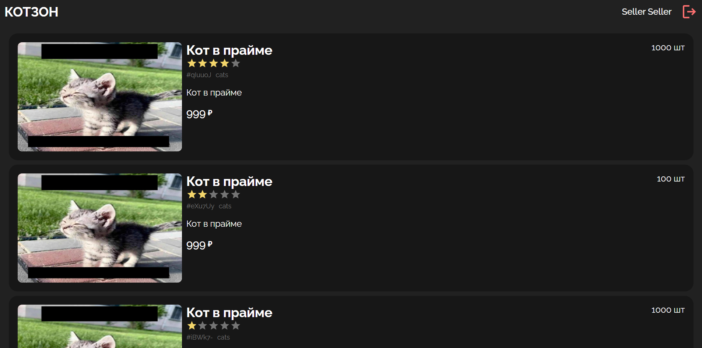

# котзон (кр 2)


Учебный проект интернет-магазина: фронтенд на React + TypeScript и API на Express + TypeScript.

В этой версии собраны темы практик 7-12:

- регистрация и вход пользователя;
- bcrypt-хэширование паролей;
- JWT access/refresh токены;
- обновление токенов через `/api/auth/refresh`;
- ролевая модель доступа (RBAC);
- управление товарами и пользователями.

## Что внутри

- `src/` - клиентская часть (Vite + React)
- `api/` - серверная часть (Express)
- `public/images/` - изображения товаров
- `Dockerfile`, `api/Dockerfile`, `nginx.conf` - контейнеризация фронта и бэка

## Структура проекта

```text
pr11-12/
|-- src/
|   |-- components/          # UI-компоненты (модалки, карточки, списки)
|   |-- context/             # AuthContext и логика авторизации на клиенте
|   |-- pages/               # Страницы (товары, админка)
|   |-- api.ts               # Axios-клиент, интерсепторы, API-методы
|   |-- App.tsx              # Роутинг и основной layout
|   `-- main.tsx             # Точка входа React-приложения
|-- api/
|   |-- controllers/         # Обработчики маршрутов (auth, products, users)
|   |-- middleware/          # authMiddleware и roleMiddleware
|   |-- app.ts               # Конфигурация Express и регистрация маршрутов
|   |-- db.ts                # In-memory хранилище, токены, тестовые пользователи
|   `-- config.ts            # JWT-секреты и время жизни токенов
|-- public/images/           # Статические изображения товаров
|-- Dockerfile               # Сборка и запуск фронтенда (Nginx)
|-- api/Dockerfile           # Сборка и запуск backend
`-- nginx.conf               # Конфиг Nginx для SPA (try_files -> index.html)
```

Важные файлы:

- `api/app.ts` - центральная точка API: тут видно все маршруты и какие middleware к ним применяются.
- `api/middleware/auth.ts` - проверка access-токена и блокировки пользователя.
- `api/middleware/role.ts` - проверка роли для защищенных маршрутов.
- `api/controllers/auth/Refresh.ts` - логика обновления токенов (refresh flow).
- `src/api.ts` - вся клиентская работа с API, включая автообновление токена при `401`.
- `src/context/AuthContext.tsx` - хранение состояния авторизации в клиенте.

## Технологии

Frontend:

- React
- TypeScript
- Vite
- React Router
- Axios
- SCSS

Backend:

- Node.js
- Express
- TypeScript
- bcrypt
- jsonwebtoken
- Swagger (swagger-jsdoc + swagger-ui-express)

## Основной функционал

- Аутентификация: регистрация, вход, получение текущего пользователя.
- Токены: access + refresh, обновление пары токенов при истечении access.
- Товары: создание, просмотр списка и карточки, редактирование, удаление.
- Пользователи: просмотр списка, просмотр по id, редактирование, блокировка.
- Роли: `user`, `seller`, `admin` (ограничения выставляются через middleware).

## Роли и доступ

Ролевая логика реализована на сервере через `authMiddleware` и `roleMiddleware`.

- `user`: базовый доступ к пользовательским операциям.
- `seller`: операции с товарами для продавца.
- `admin`: админские операции с пользователями.

Точные ограничения зависят от настроек маршрутов в `api/app.ts`.

## Запуск локально

Требования:

- Node.js 24+
- npm

1. Установить зависимости фронтенда (корень `pr11-12`):
    ```bash
    npm install
    ```
2. Установить зависимости бэкенда:
    ```bash
    cd api
    npm install
    ```

Терминал 1 (бэкенд):

```bash
cd api
npm run dev
```

Терминал 2 (фронтенд):

```bash
npm run dev
```

По умолчанию:

- API: `http://localhost:3000`
- Swagger: `http://localhost:3000/api-docs`
- Frontend (Vite): `http://localhost:5173`

## API и доступ по ролям

Таблица ниже отражает текущую конфигурацию маршрутов в `api/app.ts`.

| Метод  | Endpoint             | Гость | user | seller | admin |
| ------ | -------------------- | ----: | ---: | -----: | ----: |
| POST   | `/api/auth/register` |    ✅ |   ✅ |     ✅ |    ✅ |
| POST   | `/api/auth/login`    |    ✅ |   ✅ |     ✅ |    ✅ |
| POST   | `/api/auth/refresh`  |    ✅ |   ✅ |     ✅ |    ✅ |
| GET    | `/api/users/me`      |    ❌ |   ✅ |     ✅ |    ✅ |
| GET    | `/api/users`         |    ❌ |   ❌ |     ❌ |    ✅ |
| GET    | `/api/users/:id`     |    ❌ |   ❌ |     ❌ |    ✅ |
| PATCH  | `/api/users/:id`     |    ❌ |   ❌ |     ❌ |    ✅ |
| DELETE | `/api/users/:id`     |    ❌ |   ❌ |     ❌ |    ✅ |
| GET    | `/api/products`      |    ❌ |   ✅ |     ✅ |    ✅ |
| GET    | `/api/products/:id`  |    ❌ |   ✅ |     ✅ |    ✅ |
| POST   | `/api/products`      |    ❌ |   ❌ |     ✅ |    ❌ |
| PATCH  | `/api/products/:id`  |    ❌ |   ❌ |     ✅ |    ❌ |
| DELETE | `/api/products/:id`  |    ❌ |   ❌ |     ✅ |    ❌ |

Примечание: сейчас операции с товарами настроены на роль `seller`, а доступ к просмотру - только через `user` для соответствующих GET-маршрутов.

## Тестовые пользователи

В `api/db.ts` заранее добавлены тестовые аккаунты:

- `admin@example.com` / `admin`
- `seller@example.com` / `seller`
- `user@example.com` / `user`

## Важно

- Проект учебный: данные хранятся в памяти и сбрасываются при перезапуске сервера.
- JWT-секреты и сроки жизни токенов сейчас заданы в `api/config.ts`.
- Для production нужен перенос на БД и вынесение конфигурации в переменные окружения.
